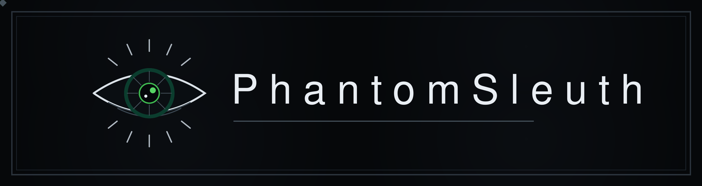

<div align="center">



<br>


</div>

---

```bash
$ whoami
PhantomSleuth
> financial-crime & OSINT investigator, turned tool builder
> self-taught in Python
> i build tools for fun
> OSINT for good
> house rule: every finding is a lead, never proof
```

### `//` focus


### `//` currently building

**A bronze guardian**

### `//` find me

- 📫 `phantomsleuth@proton.me`
